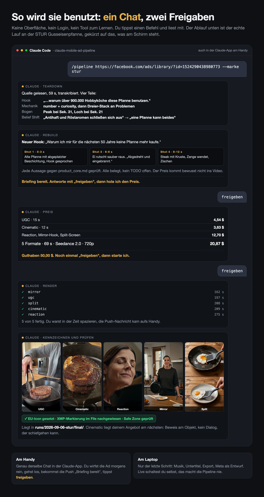
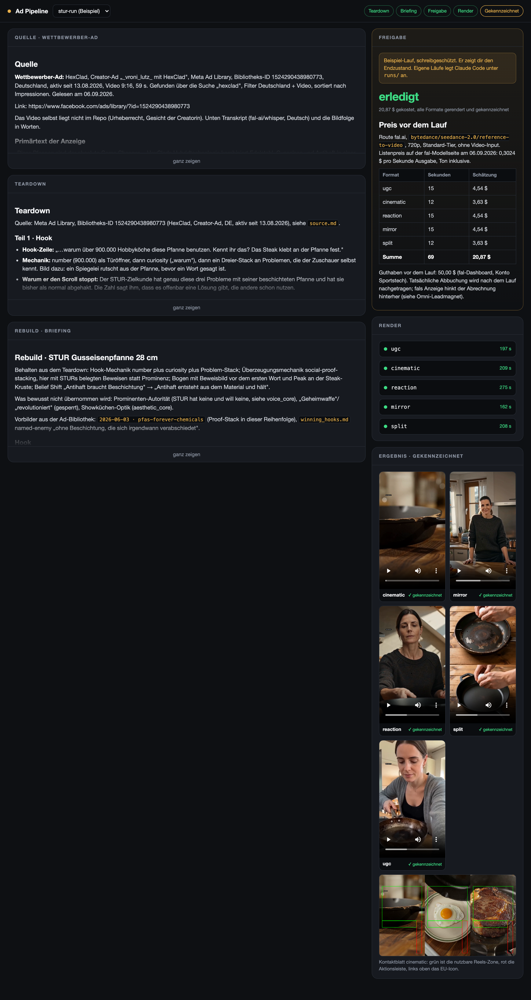
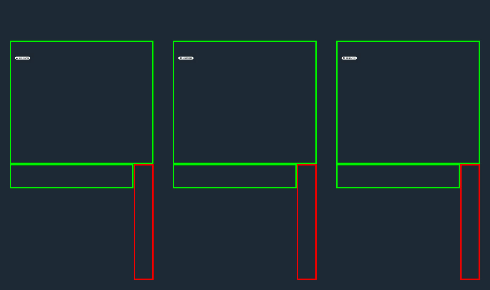

# Mobile Ad Pipeline: Claude Code + KI-Kennzeichnung

Eine Winner-Ad des Wettbewerbers rein, fünf fertige und gekennzeichnete 9:16-Clips für dein eigenes Produkt raus. Du steuerst die Pipeline vom Handy, das Rendern läuft über ein Videomodell deiner Wahl, die Kennzeichnung nach Art. 50 EU AI Act über den KI-Kennzeichnung-MCP. Der Laptop kommt erst am Ende für den Feinschliff ins Spiel.

Dieses Repo ist der komplette Bausatz: sechs Claude-Code-Skills, die Markenkontext-Vorlagen, der Orchestrator-Prompt für die Claude-App am Handy, die Prüfskripte und ein durchgerechneter Lauf an einer echten Marke.

## Was die Pipeline macht

| Schritt | Skill | Was passiert | Wo du bist |
|---|---|---|---|
| 1 | `/teardown` | Zerlegt die Wettbewerber-Ad in Hook, Mechanik, emotionalen Bogen und Belief Shift | Handy |
| 2 | `/rebuild` | Baut auf denselben Knochen ein 6-Shot-Storyboard für dein Produkt, in deiner Stimme | Handy |
| 3 | Freigabe | Du liest das Briefing, antwortest `freigeben`. Vorher siehst du den Preis für die Renders | Handy |
| 4 | `/render` | Fünf Format-Varianten: UGC, Cinematic, Reaction, Mirror-Hook, Split-Screen | unterwegs |
| 5 | `/label` | Jeder Clip bekommt das offizielle EU-Icon und die maschinenlesbare XMP/IPTC-Markierung, platziert innerhalb der Reels-Safe-Zone | unterwegs |
| 6 | Prüfen | Kontaktblatt pro Clip mit eingezeichneter Safe Zone, Markierung wird im File nachgewiesen. Dann Schnittprogramm und Meta-Entwurf | Laptop |

`/pipeline` fährt die Schritte 1 bis 5 in einem Zug und hält nur an, bevor Geld ausgegeben wird.

## Schnellstart

Du brauchst: [Claude Code](https://claude.com/claude-code), `ffmpeg` (`brew install ffmpeg`), Python 3 und **eine** der beiden Render-Routen.

```bash
git clone https://github.com/Scalemaker/claude-mobile-ad-pipeline.git
cd claude-mobile-ad-pipeline
cp .env.example .env
claude
```

Beim ersten Start fragt Claude Code, ob es die MCP-Server aus `.mcp.json` laden darf. Ja sagen. Beide laufen über OAuth: beim ersten Aufruf eines Tools öffnet sich der Browser zum Login.

**Render-Route wählen.** Für fal.ai einen Key auf [fal.ai/dashboard/keys](https://fal.ai/dashboard/keys) holen und als `FAL_KEY` in die `.env` schreiben. Für Higgsfield reicht der OAuth-Login des MCP-Servers. Beide gleichzeitig geht auch.

Dann im Chat:

```
/brand-setup
```

Der Skill fragt dich die Markenwerte ab und legt `brand/<marke>/` aus den Vorlagen an. Was du an Ad-Historie hast (letzte Gewinner, Hooks, Skripte), kommt in die Dateien dort. Ohne diese Dateien schreibt die Pipeline Ads, die nach niemandem klingen.

Einrichtung prüfen:

```bash
scripts/check-setup.sh
```

Das Skript sagt dir zu jedem Punkt, was fehlt und wie du es behebst, und nennt dein fal-Guthaben.

## So sieht ein Lauf aus

```
/pipeline https://www.facebook.com/ads/library/?id=... --marke demo
```

oder mit einem Screenshot plus Transkript, wenn du die Ad nur als Bild hast. Willst du über fal.ai rendern: `--provider fal` anhängen. Alles, was ein Lauf erzeugt, liegt danach in `runs/<datum>-<slug>/`:

```
runs/2026-09-06-demo/
├── source.md         die Ad, wie du sie reingegeben hast
├── teardown.md       die vier Teile
├── rebuild.md        Hook, Storyboard, Voiceover, Locks
├── cost.md           der Preis, den du vor der Freigabe gesehen hast
├── prompts.json      die fünf Format-Prompts, wie sie ans Modell gingen
├── render.json       Job-IDs und Ergebnis-URLs je Format
└── final/            gekennzeichnete Clips plus Kontaktblätter
```

## Ein echter Lauf zum Nachlesen

[examples/stur-run](examples/stur-run/) ist die Pipeline einmal komplett an einer echten Marke: Markenkontext von sturcookware.de, eine aktive HexClad-Ad aus der Meta Ad Library als Quelle, Teardown, Rebuild, fünf Formate gerendert, alle fünf gekennzeichnet, Kontaktblätter dabei. Inklusive der zwei Grenzen, die erst der Lauf gezeigt hat.

## So wird sie benutzt

Zwei Wege, gleicher Ablauf.

**Im Chat.** Du tippst einen Befehl in Claude Code und liest mit, zwei Freigaben, fertig.



**Im Cockpit.** Wenn du lieber siehst statt scrollst, starte die lokale Seite:

```bash
python3 scripts/ui.py        # http://127.0.0.1:7788
```



Dort gibst du die Wettbewerber-Ad rein, per Link, Transkript oder Datei. Das Cockpit legt den Lauf an und nennt dir den Befehl für Claude Code. Danach zeigt es den Lauf nebeneinander: Quelle, Teardown, Briefing links, Preis mit Freigabe-Knopf, Render-Fortschritt und die fertigen Clips rechts. Sie denkt nicht, das macht weiter Claude Code, und sie startet nichts ohne deinen Klick. Ohne Abhängigkeiten, nur Python 3, und sie hört ausschließlich auf 127.0.0.1. Der mitgelieferte STUR-Lauf ist sofort sichtbar.

**Zum Ansehen ohne Installation:** [cockpit-ui-lyart.vercel.app](https://cockpit-ui-lyart.vercel.app) zeigt denselben Ablauf zum Durchklicken, mit den echten Daten dieses Laufs. Das ist ein Prototyp, er rendert nichts und kostet nichts. Quelltext: [Scalemaker/ad-pipeline-cockpit](https://github.com/Scalemaker/ad-pipeline-cockpit).

## So sieht die Prüfung aus



Grün ist die nutzbare Reels-Zone, rot die Aktionsleiste, links oben das EU-Icon, gesetzt über den KI-Kennzeichnung-MCP. Der Clip dazu liegt als `docs/safe-zone-testclip-labeled.mp4` im Repo, die Rohfassung daneben. Probier es aus:

```bash
scripts/contact-sheet.sh docs/safe-zone-testclip-labeled.mp4
```

## Was gemessen ist und was nicht

Damit du weißt, worauf du dich verlassen kannst:

- **Verifiziert:** die Route über fal.ai (Seedance 2.0), die Kennzeichnung samt Nachweis der XMP-Markierung im File, die Safe-Zone-Geometrie, das Kontaktblatt, `check-setup.sh`, die Bibliothekspflege.
- **Gebaut, aber nicht end-to-end gelaufen:** die Route über den Higgsfield-MCP. Sie folgt der dokumentierten Tool-Beschreibung, mangels Guthaben fehlt der Beweis. Prüf dort die Antworten des Servers, statt sie vorauszusetzen.
- **Nicht gemessen:** wie oft die fünf Formate über viele Läufe hinweg unterscheidbar bleiben. Wir haben einen Lauf, keine Statistik.

Ehrliche Grenzen stehen in [docs/grenzen.md](docs/grenzen.md), die typischen Fehler samt Fix in [docs/fehler-und-fixes.md](docs/fehler-und-fixes.md), und was du besser bleiben lässt in [docs/was-nicht-tun.md](docs/was-nicht-tun.md).

## Vom Handy aus

Drei Wege, alle drei funktionieren heute, keiner braucht einen Trick. Ausführlich in [docs/mobile.md](docs/mobile.md).

1. **Claude Code mit Remote Control.** Auf dem Mac `claude --remote-control` starten, dann die Session in der Claude-App am Handy übernehmen. Freigaben und Rückfragen laufen als Push auf dein Handy, solange die Verbindung steht.
2. **Claude-App mit Projekt.** Den Prompt aus `prompts/orchestrator-system-prompt.md` als Projektanweisung, die Markendateien als Projektwissen, die Connectoren aktivieren. Läuft komplett am Handy, ohne Mac.
3. **Routine.** Ein Cloud-Lauf zu fester Uhrzeit, der eine Watchlist an Ads abarbeitet und dir die Briefings zur Freigabe hinlegt.

## Was diese Pipeline von anderen unterscheidet

- **Kennzeichnung ist ein Pipeline-Schritt, keine Nachfrage.** Seit dem 2. August 2026 gilt Art. 50 EU AI Act. Welche Pflicht dich trifft, hängt von deiner Rolle ab. Die Pipeline setzt Icon und Markierung auf jeden Clip, bevor er den Ordner verlässt. Ob damit deine Pflicht erfüllt ist, entscheidet dein Einzelfall, nicht ein Tool.
- **Safe Zone ist Geometrie, keine Bitte.** Icon und Kontaktblatt arbeiten mit den ausgemessenen Meta-Safe-Zones. Reels ist dabei kein Rechteck, sondern ein L, weil die Aktionsleiste rechts hineinragt.
- **Formate sind schwache Diversifikation.** Fünf Formate derselben Idee sind für Metas Auslieferung ein Kandidat mit fünf Gesichtern. `/rebuild --angles` baut stattdessen drei Rebuilds entlang der Kern-Angles Pain, Benefit, Proof. Das sind drei Kandidaten.
- **Der Halt vor dem Geld ist eingebaut.** Kein Render startet ohne das Wort `freigeben`, und der Preis steht vorher im Chat.

## Aufbau

```
.claude/skills/     brand-setup, teardown, rebuild, render, label, pipeline
.mcp.json           Higgsfield-MCP und KI-Kennzeichnung-MCP, Projekt-Scope
CLAUDE.md           die Regeln, nach denen Claude Code hier arbeitet
brand/_template/    die neun Markendateien als Vorlage
prompts/            Orchestrator-Prompt (Handy), Teardown, Rebuild, Format-Rahmen
scripts/            ui (lokales Cockpit), check-setup, contact-sheet, render-fal, fal-upload, rotate-library, render-html
docs/               mobile, grenzen, fehler-und-fixes, was-nicht-tun, post (Grafiken fürs Ausspielen)
examples/stur-run/  ein echter Lauf mit fünf gerenderten, gekennzeichneten Clips
```

## Lizenz

MIT. Die EU-Icons gehören der Europäischen Kommission und kommen über den KI-Kennzeichnung-MCP.

Gebaut von [Scalemaker](https://scalemaker.de). Das Kennzeichnungs-Tool dahinter: [ki-kennzeichnen.de](https://ki-kennzeichnen.de).
