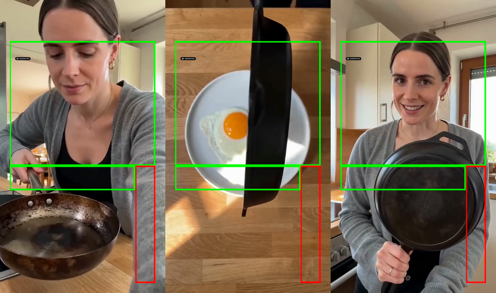
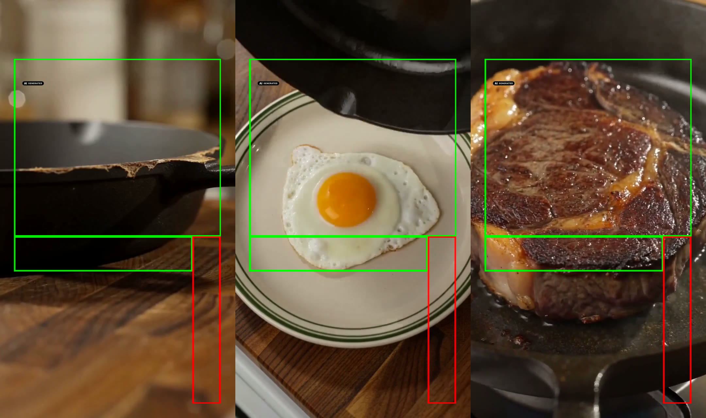
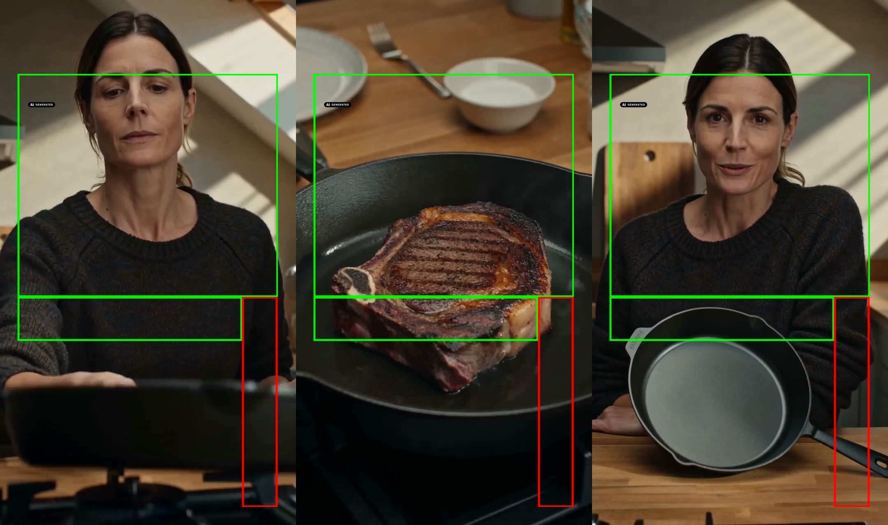
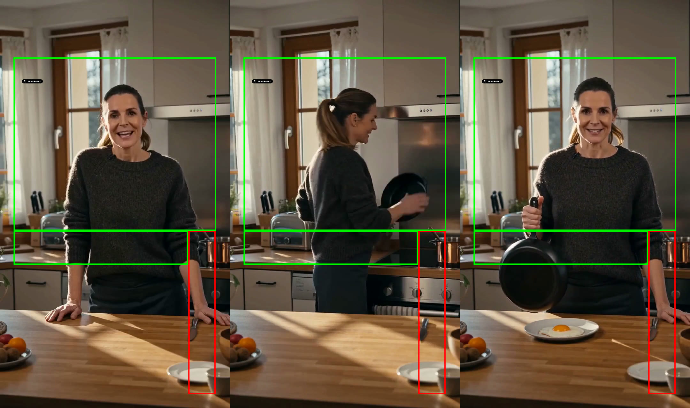
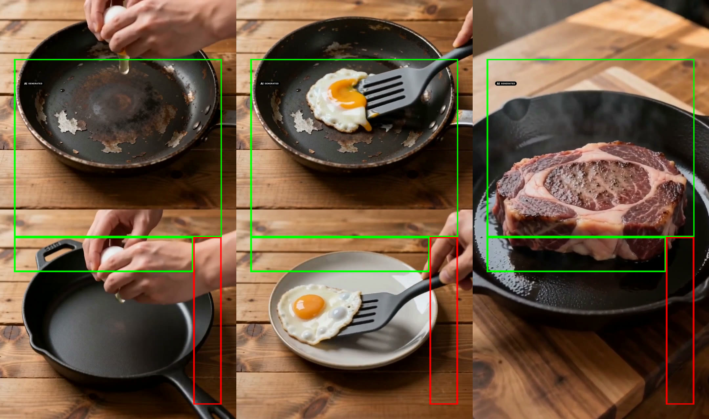

# Beispiel-Lauf · STUR Cookware

Ein echter Durchlauf der Pipeline an einer echten Marke, damit du siehst, was rauskommt, bevor du deine eigene Marke einträgst.

**Rechtlicher Rahmen:** STUR (sturcookware.de) ist kein Kunde von Scalemaker. Alles hier ist Spec-Arbeit zu Demonstrationszwecken. Die Clips dürfen nicht geschaltet und nicht als Material von STUR ausgegeben werden. Die Wettbewerber-Ad von HexClad wird nur analysiert und zitiert, das Video liegt nicht im Repo.

## Was hier passiert ist (06.09.2026)

| Schritt | Ergebnis | Datei |
|---|---|---|
| Markenkontext | neun Dateien aus Website, Über-uns-Seite, Reviews und fünf aktiven STUR-Ads in der Meta Ad Library | `brand-stur/` |
| Quelle | HexClad-Creator-Ad, Bibliotheks-ID 1524290438980773, aktiv seit 13.08.2026, 59 s, transkribiert mit fal-ai/whisper | `source.md` |
| Teardown | Hook (number + curiosity + Problem-Stack), Mechanik (Social-Proof-Stack + Autorität), Bogen mit Peak an der Steak-Kruste, Belief Shift | `teardown.md` |
| Rebuild | Hook „Warum ich mir für die nächsten 50 Jahre keine Pfanne mehr kaufe.", 6 Shots, jede Aussage mit Beleg | `rebuild.md` |
| Preis | 69 s Video ≈ 20,87 $ nach Listenpreis, Freigabe vor dem Lauf | `cost.md` |
| Render | fünf Formate über fal.ai, Seedance 2.0 reference-to-video, Produktfreisteller als @Image1 | `prompts.md`, `raw/render.json` |
| Kennzeichnen | nicht Teil der Pipeline, hier zum Zeigen mit dem Tool auf ki-kennzeichnen.de gemacht | `final/*-labeled.mp4` |
| Prüfen | Kontaktblatt je Clip mit Safe-Zone-L | `final/*-sheet.jpg` |

## Warum fal.ai und nicht Higgsfield

Der Higgsfield-Account, mit dem das Repo gebaut wurde, hatte kein Guthaben. Die Pipeline ist am Modell nicht festgemacht: `/render --provider fal` nimmt dieselben Prompts und schickt sie über `scripts/render-fal.py` an Seedance 2.0. Das ist der Beweis, dass du das Modell tauschen kannst, ohne Teardown, Rebuild oder Kennzeichnung anzufassen.

## Ergebnisse

Alle fünf Clips sind Erstversuche, kein Cherry-Picking. Der UGC-Clip liegt zweimal vor, weil der erste Lauf die wichtigste Grenze gezeigt hat.

| Format | Was im Clip passiert | Urteil |
|---|---|---|
| UGC v1 | Beschichtete Pfanne, STUR vom Herd, Ei rutscht, Steak, Proof frontal. Bild sauber, 33 Wörter Deutsch als Brei | Bild ja, Ton nein |
| UGC v2 | Gleicher Ablauf, nur zwei Kurzsätze: „Nie wieder." und „50 Jahre Garantie." Beide sauber | Format-Sieger für den Schnitt |
| Cinematic | Abgeplatzte Beschichtung im Makro, STUR über Gasflamme, Ei, Steak-Kruste mit Push-in. Kein Dialog | stärkster Clip, geht direkt in die Nachbearbeitung |
| Reaction | Pfanne von unten ins Bild, Ei, Steak, Riech-Moment mit geschlossenen Augen, „Nie wieder Beschichtung." | funktioniert, Steak hat Grillstreifen (siehe brain.md) |
| Mirror-Hook | Statisch, Zitat aus icp_core („Ich kenne Gusseisen noch von Oma"), Drehung zur Pfanne, Ei. Dialog teils Brei | Bild ja, Ton nur der Kurzsatz |
| Split-Screen | Oben klebt das Ei in der beschichteten Pfanne, unten rutscht es, harter Schnitt aufs Steak | funktioniert, ohne Dialog |

Grün ist die nutzbare Reels-Zone, rot die Aktionsleiste, links oben das EU-Icon. Das Kennzeichnen gehört nicht zur Pipeline, es ist der Schritt danach auf ki-kennzeichnen.de. Für diesen Lauf haben wir ihn mitgemacht, damit du siehst, wie das Ergebnis aussieht.

## Was der Lauf gekostet hat

fal-Guthaben vor dem Lauf 50,00 $, nach fünf Clips 29,06 $, also 20,94 $ für 69 Sekunden Video (Schätzung vorher: 20,87 $). Der UGC-Neurender (15 s) kam mit rund 4,50 $ dazu, plus Cent-Beträge für die Whisper-Transkripte.

## Was in brain.md gewandert ist

Vier Einträge unter „funktioniert", drei unter „vermeiden", siehe `brand-stur/brain.md`. Der wichtigste: deutsche Dialoge nur als Kurzsätze.
